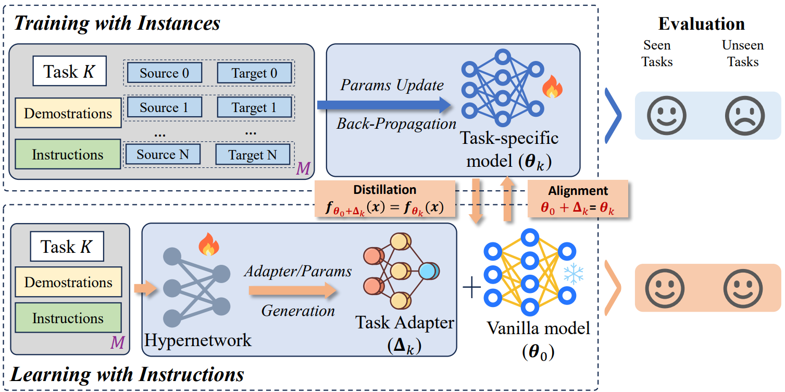

# 📄 From Instance Training to Instruction Learning: Task Adapters Generation from Instructions 💡

<p align="center" style="font-size:200%">
    
    
    
</p>

<!-- <p align="center" style="font-size:200%"> -->
<!-- 🔔 <a href="https://github.com/Xnhyacinth/TAGI" target="_self">Code</a> • 📃 <a href="https://arxiv.org/abs/2406.12382" target="_self">Paper</a> <br>  -->
<p align="center"><font size=6>📃</font> <a target="_self" href="https://openreview.net/forum?id=CluvZBfrjj"> </a> <font size=6>•</font> <font size=6>🔔</font> <a target="_self" href="https://github.com/Xnhyacinth/TAGI"> </a> <font size=6>•</font> <font size=6>⛳</font> <a target="_self" href="https://xnhyacinth.github.io/TAGI"> </a></p>
<!-- </p> -->

<!-- <a target="_self" href="https://tiger-ai-lab.github.io/LongRAG/">
</a>
<a target="_self" href="https://huggingface.co/datasets/TIGER-Lab/LongRAG">
</a>
<a target="_self" href="https://x.com/WenhuChen/status/1805278871786340644">
</a>
<br> -->
## 🎓 TAGI Overview

Comparison of the typical Training withInstance and the proposed Learning with Instruction: The former involves training the model at the instance level with parameter updates, while the latter generates a task-specific adapter at the task level with parameter generation.



## 🤝 Referencing and Citing 

If you find our work useful in your research and would like to cite our project, please use the following citation: found this work useful, please consider giving this repository a star and citing our paper as follows:
```bibtex
@inproceedings{
	liao2024from,
	title={From Instance Training to Instruction Learning: Task Adapters Generation from Instructions},
	author={Huanxuan Liao and Shizhu He and Yao Xu and Yuanzhe Zhang and Yanchao Hao and Shengping Liu and Kang Liu and Jun Zhao},
	booktitle={The Thirty-eighth Annual Conference on Neural Information Processing Systems},
	year={2024},
	url={https://openreview.net/forum?id=CluvZBfrjj}
}
```
