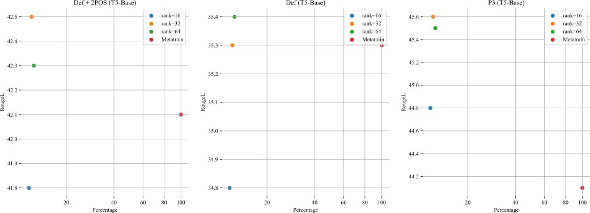

### How $\lambda_1$ and $\lambda_2$ were tuned.

In the experiment, we set $\lambda_1$ to two different values: $\lambda_1 = 5$ and $\lambda_1 = \text{sigmoid}(L_{\text{ins}})$. The effects of these different $\lambda$ values on the results are illustrated below. We will include this supplementary experiment in the appendix in the near future.

|                      | $\lambda_1$ | $\lambda_2$         | RougeL |
| -------------------- | ----------- | ------------------- | ------ |
| Def + 2POS (T5-Base) | 0.5         | $sigmoid(L_{ins} )$ | 40.1   |
|                      | 2           | $sigmoid(L_{ins} )$ | 40.9   |
|                      | 5           | $sigmoid(L_{ins} )$ | 42.5   |
|                      | 10          | $sigmoid(L_{ins} )$ | 38.7   |
|                      | 5           | 0.2                 | 41.3   |
|                      | 5           | 0.5                 | 41.6   |
|                      | 5           | 1.0                 | 41.2   |

### The parameter size of the generated hypernetworks against the corresponding performance.

In Table 7 of the appendix, we present the results of varying LoRA ranks and their impact on model performance. The table illustrates how different parameter sizes affect the model's efficacy. The corresponding table and graph is included below:

|                      | Rank | percentage | RougeL    |
| ------------------- | ---------------- | ---- | ------------------- |
| Def + 2POS (T5-Base) | 16   | 11.3%      | 41.8      |
|                      | 32   | 11.8%      | 42.5      |
|                      | 64   |    12.2%        | 42.3      |
| Metatrain | - |    100%       | 42.1   |
| Def (T5-Base)        | 16   | 11.3%      | 34.8      |
|                      | 32   | 11.8%      | 35.3      |
|                      | 64   |    12.2%        | 35.4 |
| Metatrain | -   |    100%       | 35.3   |
| P3 (T5-Base)         | 16   | 11.3%      | 44.8      |
|                      | 32   | 11.8%      | 45.6      |
|                      | 64   | 12.2%      | 45.5      |
| Metatrain | -   |    100%       | 44.1  |

